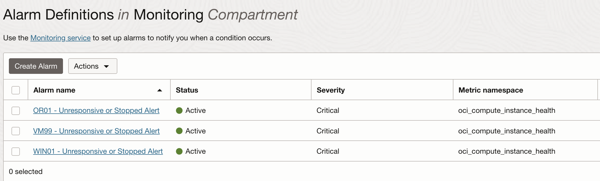
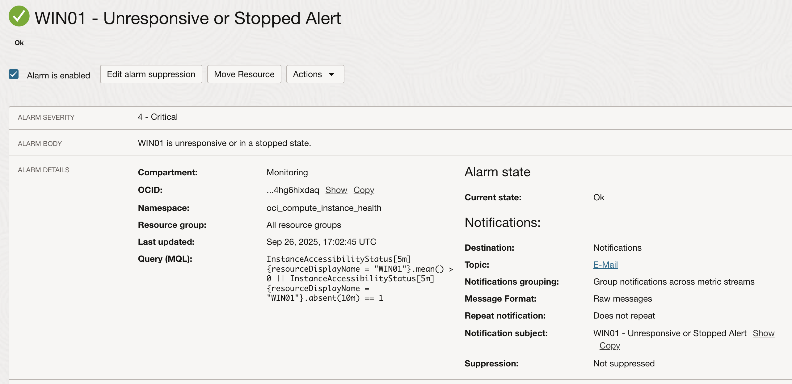
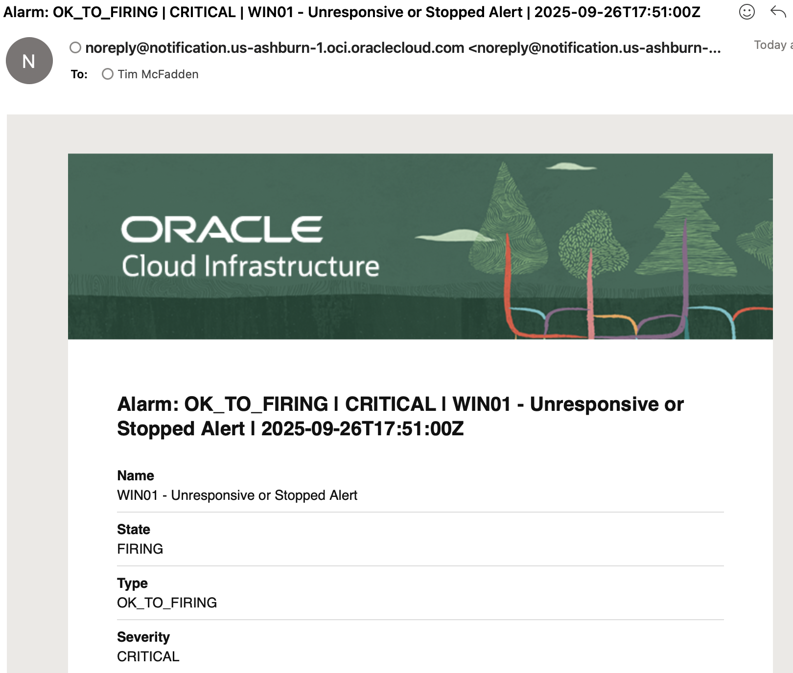

# Oracle Cloud Infrastructure (OCI) VM Alarms Setup Guide

This guide explains how to use the example oci_vm_alarms.py script to automatically create heartbeat alarms for your virtual machines in Oracle Cloud Infrastructure.

**Download**: [https://gist.githubusercontent.com/timmcfadden/a5c97eaee35830487153d3213dd0fdc4/raw/1844c9e24fdec6ca5ab8f5e2605d421726fa2f40/oci_vm_alarms.py
](https://github.com/timmcfadden/OCIHeartbeat/releases/download/Release/oci_vm_alarms.py)




**Example Query**: `InstanceAccessibilityStatus[5m]{resourceDisplayName = "Win01"}.mean() > 0 || InstanceAccessibilityStatus[5m]{resourceDisplayName = "Win01"}.absent(10m) == 1`

## What This Script Does

The oci_vm_alarms.py script automatically:

- Finds all running virtual machines (VMs) in your Oracle Cloud compartment OR monitors a single specific VM
- Creates monitoring alarms that detect when VMs become unresponsive or stop
- Sends email notifications when alarms trigger (notification topic required)

## Prerequisites

### 1. Oracle Cloud Infrastructure (OCI) Account
- You need an active OCI account with access to compute instances
- You should have virtual machines already running in OCI

### 2. Python Requirements
- Python 3.6 or higher
- OCI Python SDK

Install the OCI SDK:
```bash
pip install oci
```

## Step 1: Install and Configure OCI CLI

### Install OCI CLI

**On macOS:**
```bash
brew install oci-cli
```

**On Linux:**
```bash
bash -c "$(curl -L https://raw.githubusercontent.com/oracle/oci-cli/master/scripts/install/install.sh)"
```

**On Windows:**
Download and run the installer from: https://docs.oracle.com/en-us/iaas/Content/API/SDKDocs/cliinstall.htm

### Configure OCI CLI

Run the setup command:
```bash
oci setup config
```

You'll be prompted for:
- **Location for config file**: Press Enter to use default (`~/.oci/config`)
- **User OCID**: Find this in OCI Console → Identity & Security → Users → Your Username
- **Tenancy OCID**: Find this in OCI Console → Administration → Tenancy Details
- **Region**: Choose your home region (e.g., `us-ashburn-1`, `us-phoenix-1`)
- **Generate new API key**: Press Y to generate new keys
- **Location for key files**: Press Enter for default location
- **Passphrase**: Optional, press Enter to skip

### Add API Key to OCI Console

After configuration, you need to add the public key to your OCI user:

1. Go to OCI Console → Identity & Security → Users → Your Username
2. Click "API Keys" in the left menu
3. Click "Add API Key"
4. Choose "Paste public key"
5. Copy the contents of `~/.oci/oci_api_key_public.pem` and paste it
6. Click "Add"

## Step 2: Find Required Information

### Get Your Compartment OCID

1. In OCI Console, go to Identity & Security → Compartments
2. Find the compartment containing your VMs
3. Click on the compartment name
4. Copy the OCID (starts with `ocid1.compartment.`)

### Get VM Instance OCID (For Single VM Mode) - OPTIONAL

To create an alarm for just one VM, you can get its instance OCID:

1. In OCI Console, go to Compute → Instances
2. Find the specific VM you want to monitor
3. Click on the VM name
4. Copy the OCID (starts with `ocid1.instance.`)

**Note**: When using single VM mode, the compartment is automatically detected from the VM OCID, so you don't need to specify it separately.

### Get or Create a Notification Topic (Required)

**IMPORTANT**: This script requires a notification topic to send email alerts when VMs go down.

#### Option 1: Use an Existing Notification Topic

If you already have a notification topic (even in a different compartment), you can use it:

1. Go to Developer Services → Notifications
2. Find your existing topic in any compartment
3. Click on the topic name
4. Copy the Topic OCID (starts with `ocid1.onstopic.`)
5. Ensure you have an email subscription set up for the topic

**Note**: Notification topics can be used across compartments, so you can reuse existing topics for VM monitoring.

#### Option 2: Create a New Notification Topic

If you don't have a notification topic, create one:

1. Go to Developer Services → Notifications
2. Click "Create Topic"
3. Enter a name (e.g., "VM-Alerts")
4. Click "Create"
5. Copy the Topic OCID (starts with `ocid1.onstopic.`)
6. Click on the topic name, then "Create Subscription"
7. Choose "Email" protocol and enter your email address
8. Check your email and confirm the subscription

## Step 3: Run the Script

### Usage Options

The script supports two modes with proper command line flags:

**1. Create alarms for ALL VMs in a compartment:**
```bash
python3 oci_vm_alarms.py --compartment <compartment_ocid> --topic <notification_topic_ocid>
```

**2. Create alarm for a SPECIFIC VM (compartment auto-detected):**
```bash
python3 oci_vm_alarms.py --vm-ocid <vm_instance_ocid> --topic <notification_topic_ocid>
```

### Examples

**Create alarms for all VMs:**
```bash
python3 oci_vm_alarms.py --compartment ocid1.compartment.oc1..aaaaaaaa123456789 --topic ocid1.onstopic.oc1..bbbbbbbb987654321
```

**Create alarm for one specific VM (using your VM OCID):**
```bash
python3 oci_vm_alarms.py --vm-ocid ocid1.instance.oc1.iad.anuwcljruox3l7icuhsical76jiwbtnud37ckglq6po3d3rwl5gtoutlsbga --topic ocid1.onstopic.oc1..bbbbbbbb987654321
```

### Non-Interactive Mode

Add `--non-interactive` to skip interactive prompts (useful for automation):
```bash
python3 oci_vm_alarms.py --vm-ocid ocid1.instance.oc1..your-vm-ocid --topic ocid1.onstopic.oc1..your-topic --non-interactive
```

### Help

Get help with all available options:
```bash
python3 oci_vm_alarms.py --help
```

## What Happens When You Run the Script

### For All VMs Mode:
1. **Authentication**: Script uses your OCI configuration to authenticate
2. **Topic Validation**: Verifies the notification topic exists and is active
3. **VM Discovery**: Finds all running VMs in the specified compartment
4. **Alarm Creation**: Creates monitoring alarms for each VM that detect:
   - VM becomes unresponsive
   - VM stops running
5. **Notifications**: Sends email alerts via the notification topic when alarms trigger
6. **Summary**: Shows how many alarms were created successfully

### For Single VM Mode:
1. **Authentication**: Script uses your OCI configuration to authenticate
2. **Compartment Detection**: Automatically detects compartment from VM OCID
3. **Topic Validation**: Verifies the notification topic exists and is active
4. **VM Validation**: Fetches and validates the specific VM instance
5. **State Check**: Warns if VM is not in RUNNING state (asks for confirmation unless in non-interactive mode)
6. **Alarm Creation**: Creates monitoring alarm for the specific VM
7. **Result**: Shows success or failure for the single VM

## Understanding the Monitoring

Each alarm created will:
- **Monitor**: VM accessibility status every 5 minutes
- **Trigger**: When VM is unresponsive for 5 minutes OR hasn't reported status for 10 minutes
- **Severity**: CRITICAL
- **Name**: "[VM Name] - Unresponsive or Stopped Alert"

## Troubleshooting

### Common Errors

**"OCI config file not found"**
- Solution: Run `oci setup config` to create configuration

**"Invalid compartment OCID format"**
- Solution: Ensure OCID starts with `ocid1.compartment.`

**"Invalid notification topic OCID format"**
- Solution: Ensure OCID starts with `ocid1.onstopic.`

**"Invalid VM instance OCID format"**
- Solution: Ensure OCID starts with `ocid1.instance.` (only for single VM mode)

**"Unable to validate notification topic"**
- Solution: Check that the topic OCID is correct and the topic is in ACTIVE state
- Verify you have access to the notification topic

**"VM not found or inaccessible"**
- Solution: Verify the VM instance OCID is correct and the VM exists
- Check that the VM is in the correct compartment or you have access to it

**"Permission denied" errors**
- Solution: Ensure your OCI user has permissions for:
  - Compute instances (read)
  - Monitoring alarms (create)
  - Notification topics (read and use)

### Checking Your Configuration

Test your OCI configuration:
```bash
oci iam user get --user-id <your-user-ocid>
```

### Getting Help

- Check OCI documentation: https://docs.oracle.com/en-us/iaas/
- Verify your API key is correctly added to your OCI user
- Ensure you're using the correct region in your config

## Example Output

### All VMs Mode:
```
✓ Notification topic validated: VM-Alerts
Fetching all VMs in compartment: ocid1.compartment.oc1..aaaaaaaa123456789
Found VM: web-server-1 (ID: ocid1.instance.oc1..bbbbbbb111111)
Found VM: database-server (ID: ocid1.instance.oc1..bbbbbbb222222)

Creating alarms for 2 VMs...
Creating alarm for VM: web-server-1
✓ Alarm created successfully for web-server-1 (Alarm ID: ocid1.alarm.oc1..ccccccc333333)
Creating alarm for VM: database-server
✓ Alarm created successfully for database-server (Alarm ID: ocid1.alarm.oc1..ccccccc444444)

==================================================
ALARM CREATION SUMMARY
==================================================
Total VMs processed: 2
Alarms created successfully: 2
Failed alarm creations: 0
```

### Single VM Mode:
```
Auto-detecting compartment from VM instance...
Detected compartment: ocid1.compartment.oc1..aaaaaaaa123456789
✓ Notification topic validated: VM-Alerts
Creating alarm for single VM: ocid1.instance.oc1.iad.anuwcljruox3l7icuhsical76jiwbtnud37ckglq6po3d3rwl5gtoutlsbga
Fetching VM: ocid1.instance.oc1.iad.anuwcljruox3l7icuhsical76jiwbtnud37ckglq6po3d3rwl5gtoutlsbga
Found VM: my-web-server (State: RUNNING)
Creating alarm for VM: my-web-server
✓ Alarm created successfully for my-web-server (Alarm ID: ocid1.alarm.oc1..ccccccc333333)
✓ Successfully created alarm for my-web-server

✓ Successfully created alarm for VM
```

## Next Steps

After running the script:

1. Check OCI Console → Monitoring → Alarms to see your new alarms
2. Test an alarm by stopping a VM temporarily
3. Verify you receive email notifications
4. Consider setting up additional monitoring for other metrics like CPU or memory usage

## When to Use Each Mode

**Use All VMs Mode when:**
- Setting up monitoring for the first time
- You want consistent monitoring across all VMs in a compartment
- Managing multiple VMs at once

**Use Single VM Mode when:**
- Adding monitoring to a newly created VM
- Testing the alarm setup on one specific VM
- You only want to monitor critical VMs
- Troubleshooting alarm creation for a specific instance

## Disclaimer

This guide and the associated oci_vm_alarms.py script are provided for informational purposes only. The script is an unofficial tool created to assist with setting up heartbeat alarms for Oracle Cloud Infrastructure (OCI) virtual machines and is shared "as-is" without any warranties, express or implied, including but not limited to warranties of merchantability, fitness for a particular purpose, or non-infringement.

By using this guide or script, you acknowledge and agree that:

- You are responsible for reviewing, understanding, and testing the script in your own environment before deployment.
- The script may interact with your OCI resources, potentially incurring costs, creating alarms, or sending notifications—ensure you have appropriate permissions and monitor for any unintended effects.
